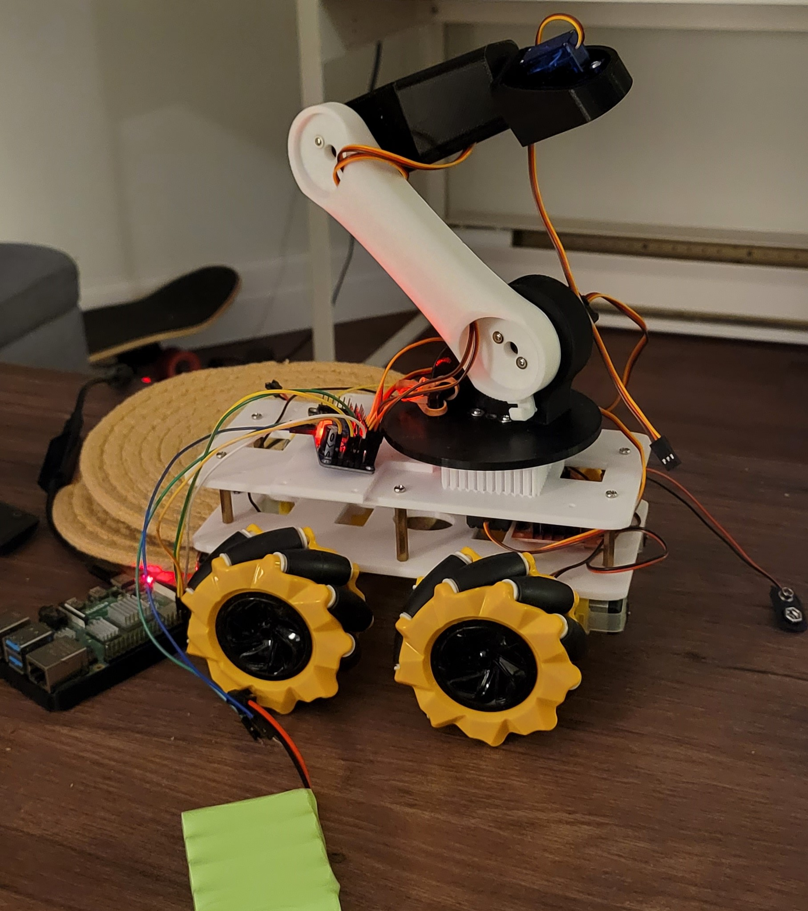

# Autonomous Indoor Bot project

## Parts and features

* Rpi4
* ubuntu 20.04
* Ros2 Foxy
* Rplidar a1
* MIPI Camera
* usb coral accelerator - Tensorflowlite (currently only used for on-bot CV)
* microphone
* Mecanum OMN wheels
* 3d printed robot arm 

